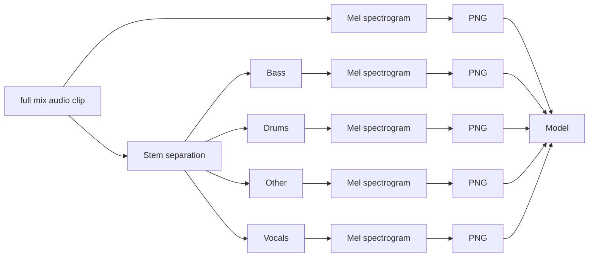
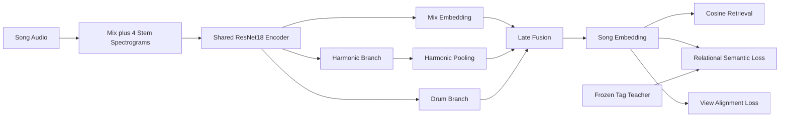

*(Keep clean and short, with separate pages for deep mathematical descriptions)*

# Deep Learning Song Recommender

**Authors:** [Nicholas Geis](https://github.com/nicholassgeis), [Mitch Hamidi-Ismert](https://github.com/mitchhi), [Juan Salinas](https://github.com/juansalinas2)

This project builds a content-based music recommender that learns song similarity directly from audio. Using full-mix and stem spectrograms, we trained a late-fusion `ResNet18` to generate song embeddings shaped by genre-tag supervision and contrastive learning. The final model powers a web app where users can explore songs and receive recommendations based on learned audio similarity.

**App Website:** https://dl-song-recommender.onrender.com


## Background (Too wordy. Needed?)

Modern music platforms are extremely good at learning from user behavior, but behavior-only recommendation has limits. It struggles with cold-start profiles, sparse interaction data, and explaining similarity based on what songs actually sound like. (I'm lying here, I don't know what modern music platforms do.)

Content-based recommendation is a necessary evolution for these systems. If a model can learn similarity directly from audio, it can improve discovery, support new or less popular tracks, and complement collaborative methods with a richer understanding of the music itself.

This project explores that direction by using deep learning to learn song embeddings from audio while using listener-provided tags as semantic supervision during training.
 

## Approach

The project follows a simple idea:

1. Build a semantic notion of similarity from listener tags.
2. Train audio models to reproduce that structure from spectrograms and stems.
3. Evaluate whether the learned embeddings produce useful song retrieval.

Genre tags provides the semantic signal during training, but the long-term aim is audio-based recommendation at inference time.

## Data and Preprocessing

Our dataset contains **11,239 songs** with associated metadata and derived audio representations. The project draws from two Kaggle sources:

1. [Augmented-Audio-10k](https://www.kaggle.com/datasets/reggiebain/augmented-audio-10k)
2. [Million Song Dataset + Spotify + Last.fm Music Tracks](https://www.kaggle.com/datasets/undefinenull/million-song-dataset-spotify-lastfm)

The metadata used throughout the project includes track identifiers, artist and title information, Spotify preview links, year, and [Last.fm](https://www.last.fm) user-generated listener tags, which were distributed within the [Million Song Dataset](http://millionsongdataset.com).

### Why Tags?

The recommender is ultimately intended to operate from audio alone at inference time, but the project needs a meaningful training signal for “musical similarity.” Listener tags provide that supervision. Tags such as `rock`, `indie`, and `chillout` give a weak but useful semantic description of how songs relate, and the later audio models are trained to reproduce that tag-informed structure from spectrogram inputs.

### Data split

The dataset is split into train, validation, and test sets (**73**/**12**/**15**) in the [preprocessing notebooks](https://github.com/mitchhi/dl-song-recommender/tree/main/notebooks/00_preprocessing). Before splitting, the project removes very rare tags (frequency less than 5) so that multilabel stratification on tags is more stable. Tag-derived structures used later in the pipeline are built **only from the training set**.  

### Audio preprocessing



Each song is represented by a **10**-second audio clip sampled at **22,050 Hz**. From that clip, the preprocessing pipeline creates four source-separated stem audio clips. Each audio clip is then represented as a mel spectrogram PNG. 

#### Step 1: Stem Separation

The full audio clip is split into four stems (bass/drums/other/vocals) using [Demucs](https://github.com/adefossez/demucs). This gives the model access not only to the full mix, but also to more musically targeted views of rhythm and harmony.

#### Step 2: Mel Spectrogram Generation

For the full mix and each stem, the project uses `librosa` to compute a [mel spectrogram](https://medium.com/analytics-vidhya/understanding-the-mel-spectrogram-fca2afa2ce53), which is a visual representation of an audio signal on a frequency scale that mimics human hearing perception.

Spectrogram magnitudes are converted to decibels normalized relative to the full mix’s maximum power and saved as an 8-bit color-mapped PNG with dimensions **862 × 256**.  

## Feature Engineering

We derive semantic supervision from listener-generated tags in the metadata for our training set. First, we compute tag co-occurrence statistics and filter noisy tag relationships using Positive PMI and minimum co-occurrence thresholds. The resulting clean tag vocabulary is used to train a skip-gram Word2Vec model, producing a 64-dimensional embedding for each valid tag. These tag embeddings are then grouped with hierarchical ward clustering into 20 semantic tag clusters, giving each tag both a dense vector representation and a cluster assignment. For each song, we map its cleaned tags into cluster IDs and compute song-level semantic features such as `tag_clusters` and `dominant_cluster`, which are used in model evaluation. 

## Model Design

The core model is a late-fusion `ResNet18` trained on spectrograms. Each song is represented by a full-mix spectrogram together with stem spectrograms, and the same encoder is applied across these views to learn a compact audio representation.



These views are combined into a single retrieval embedding,

$$
z = \mathrm{normalize}(m + \alpha_h h + \alpha_d d),
$$

where $m$ is the mix embedding, $h$ is a harmonic embedding formed from bass, other, and vocals, and $d$ is a drum embedding. The learned coefficients $\alpha_h$ and $\alpha_d$ control how strongly those musical components shape the final representation. Recommendation is then performed by nearest-neighbor search in this embedding space.

What changes across notebooks 4-7 is not the backbone so much as the learning objective. The first model uses genre-tag-based learning: genre tags define which songs should be close, and the `ResNet18` is trained to recover that tag-defined geometry from audio alone. Later models add contrastive learning to keep different views of the same song close in embedding space. The final experiment combines both ideas by training against a blended audio-tag teacher.

At a high level, the project studies one stable `ResNet18` architecture under three related training ideas: **tag-based learning**, **contrastive learning**, and **blended audio-tag supervision**. For the full architecture, loss function, and notebook-by-notebook progression, see [Model Architecture](docs/model_architecture.md).

 

## Evaluation

Saved experiment manifests show strong semantic retrieval performance across the later models.

| Model | Artist Hit@10 | Tag Overlap Hit@10 | Semantic Teacher Coverage |
| --- | ---: | ---: | ---: |
| Tag-aligned audio encoder | 0.118 | 0.944 | 0.994 |
| Contrastive semantic audio encoder | 0.141 | 0.949 | 0.993 |
| Audio-grounded contrastive encoder | 0.114 | 0.949 | 0.994 |
| Blended-teacher late-fusion encoder | 0.123 | 0.937 | 0.994 |

These results suggest...

## User Evaluation
*(Talk about this for future improvements, not for model selection.)*
<!-- Maybe some diagrams will help here. This (I believe) should be our main metric. -->


## Conclusions & Future Works
*(Add ideas as they come up. We'll synthesize everything and clean up towards the end.)*

## Repository Structure
```
.
├── configs/                 # YAML configuration files
├── data/                    # metadata, processed splits, and run data
├── docs/                    # project documentation
├── notebooks/               # preprocessing, EDA, modeling, and evaluation notebooks
├── src/song_recommender/    # package code
├── README.md
├── pyproject.toml
├── requirements.txt
└── environment.yml
```

## Installation

From the repository root:

``` console
conda env create -f environment.yml
conda activate dl-song-recommender
pip install --upgrade pip
pip install -e .
```
 
