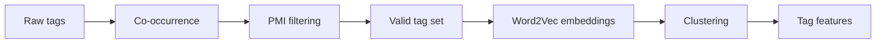
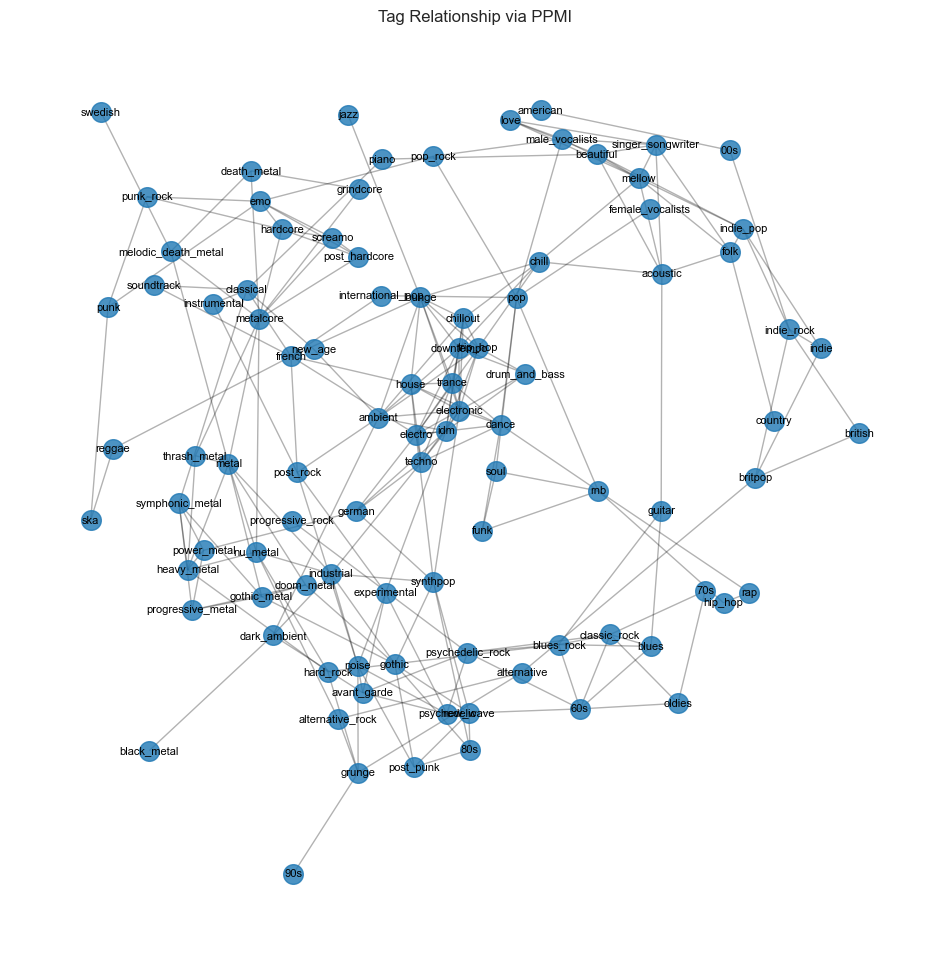
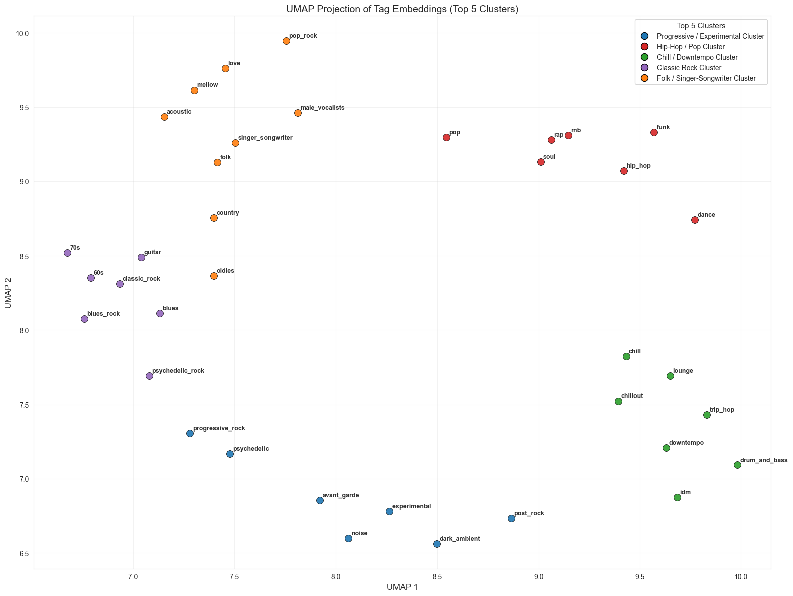

# Tag Embeddings and Clustering

This document describes the semantic pipeline used to construct a notion of song similarity from listener-generated tags that this project's audio models are trained to reproduce.

## Motivation

The goal of the project is to learn song similarity from audio. However, raw audio does not provide an explicit notion of semantic similarity.

Tags provide:
- weak supervision,
- human-aligned semantics, and
- multi-label descriptions of songs.

However, raw tags are:
- noisy (user-generated),
- long-tailed (including rare tags), and
- inconsistent across songs.

The purpose of this pipeline is to transform raw tags into a stable, structured semantic representation.

## Overview of Pipeline

The pipeline consists of three conceptual stages:

1. Statistical filtering (weighted PMI graph)
2. Representation learning (Word2Vec embeddings)
3. Structure extraction (hierarchical clustering)

### Step 1: Tag Cleaning and Filtering

Tags are normalized, i.e., lowercased, parsed into lists, then stripped of formatting noise, and rare tags (tags with frequency less than five) are removed.

This ensures:

- stable co-occurrence statistics,
- reduced sparsity, and
- improved cluster quality.

### Step 2: Tag Co-occurrence Matrix

Define $C(i)$ to be the number of songs containing tag $i$ and construct a co-occurrence matrix:

$$C(i, j) = \text{number of songs where tag } i \text{ and tag } j \text{ co-occur}$$

### Step 3: PMI / PPMI Computation

Let $N$ be the total number of songs in the training set. We compute the empirical probabilities $P(i)   = C(i) / N$ and $P(i,j) = C(i,j) / N$, i.e., the probability of tag $i$ occuring in a song and the joint probability of the tags $i$ and $j$ co-occuring, respectively. 

These probabilities are used to compute pointwise mutual information (PMI):

$$PMI(i, j) = \log\left( \frac{P(i, j)}{P(i)\cdot P(j)} \right)$$

PMI measures how often two tags appear together relative to chance. High PMI means two tags strongly belong together as PMI will be zero if the events of the tags occuring are independent, i.e., co-occurence is random.

Negative values are discarded, yielding **PPMI (positive PMI)**.

### Step 4: Edge Filtering

We keep only strong associations: `pmi_threshold = 1.5` and `min_co_occurrence = 5` to keep only legitimate relationships and remove noise from rare co-occurences.

### Step 5: Weighted Tag Graph

We construct a weighted graph where 

- nodes represent tags, 
- edges represent PMI-filtered associations, and
- edge weights represent PPMI scores.

The result is a semantic network of tags.

### Step 6: Tag Vocabulary Refinement

Using the graph, we extract valid tags, remove tags not present in the graph, and clean each song’s tag list accordingly. 

### Step 7: Word2Vec Tag Embeddings

We train a skip-gram Word2Vec model on the cleaned tag lists, where each song’s tag list is treated as a "sentence", e.g., [“rock”, “indie”, “alternative”] is treated as a sentence. The model constructs song embeddings for each song in $\mathbb{R}^{64}$. Tags that appear in similar contexts (i.e., co-occur with similar tags) will have similar vectors.

### Step 8: Hierarchical Clustering

We cluster the learned tag embeddings using Ward linkage. Ward clustering:

- minimizes within-cluster variance,
- produces compact, spherical clusters, and
- works well with dense embedding spaces.

### Step 9: Clustering 

We cluster tags into `n_clusters = 20` clusters using `fcluster` to reduce dimensionality and group synonymous tags. Each cluster represents a semantic theme, such as:

- hip hop / pop, 
- progressive / experimental, and 
- metal subgenres.

### Step 10: Cluster Feature Generation

After each tag is assigned to a cluster, each song is then mapped into cluster space producing the cluster-based features `tag_clusters` and `dominant_cluster`. In particular, `dominant_cluster` is defined to be the mode of the clusters in the list `tag_clusters` and the first appearing mode if the list is multimodal.

